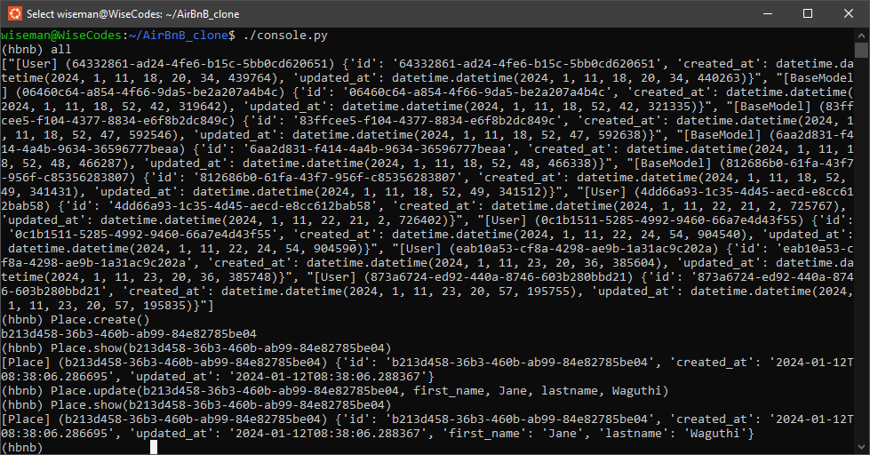
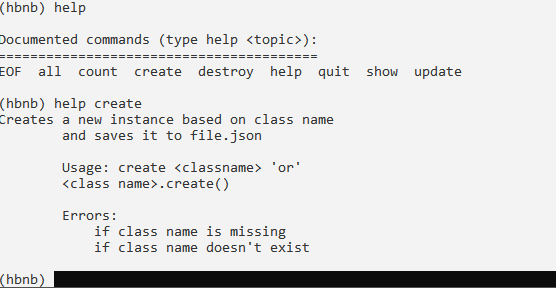

### 0x00.AirBnB Clone - The Console
The AirBnB Clone: Console is a simple yet powerful interface that allows users to create, update and destroy instances with unique IDs. With a user-friendly CLI, it provides a convenient way to harness the details of users with specific and unique IDs based on their class in a database file.

## FEATURES
* Create: creates new object (ex. a new User or a new City)
* Show/All: Retrieve an object from a file
* Operations: Do operations on objects (ex. count instances)
* Update: Update attributes of an object
* Destroy: Destroy an object

## Environment
This project is interpreted/tested on Ubuntu 20.04 LTS using python3 (version 3.10.12)

## Installation
* Clone this repository
``git clone https://github.com/wiseman-umanah/AirBnB_clone.git``

* Access AirBnb directory in your terminal
``cd AirBnB_clone``

* Run the console(interactive session)
``./console.py``
The console should open like this, where you can run the commands

* Run hbnb(non-interactively): echo "<command>" | ./console.py

## Description
 This team project is part of alx  Software Engineer program. It's the first step towards building a first full web application: an AirBnB clone.
 This first step consists of a custom command-line interface for data management,and the base classes for the storage of this data.

## Console and Command Usage
The console is a Unix shell-like command line user interface provided by the python CmdModule It prints a prompt and waits for the user for input, for our project we used (hbnb)

| Command | Example   |
| ------- | --------- |
|Display commands help| (hbnb) help <command>             
|Create object (prints its id)	      | (hbnb) create <class>) or (<class>).create()|
|Destroy object	                      | (hbnb) destroy <class> <id> or (hbnb) <class>.destroy(<id>)                  |
|Show object                          | (hbnb) show <class> <id> or (hbnb) <class>.show(<id>)                        |
|Show "all" objects or instances class|	(hbnb) all or (hbnb) all <class> or <class>.all()                                             |
|Run console	                      | ./console.py                                                                 |
|Quit console                         | (hbnb)quit                                                                   |

Help command example

## Class Models Used

|  File	            |  Description  |   Attributes  |
|-----------------  | ------------- | ------------  |
| base_model.py     |The BaseModel class is inherited by other |id, created_at, updated_at |
|user.py            |User class stores user-related info          |email, password, first_name, last_name |
|city.py	    |City class stores city-specific information  |state_id, name |
|state.py	    |State class stores state-specific information|	name                                            |
|                   |                                             |                                                     |
|place.py	    |Place class stores full detailed outline     |                                                     |
|                   |of rental unit features	                  |city_id, user_id, name, description,number_rooms,    |
|                   |                                             |number_rooms, number_bathrooms, max_guest,           |
|                   |                                             |price_by_night, latitude, longitude, amenity_ids     |
|review.py          |Review class stores previous customer reviews|place_id, user_id, text                              |                  
|                   |and opinions                                 |                                                     |
|amenity.py         |Amenity class stores highlighted amenity     | name                                                |
|                   |information                                  |                                                     |

## Tests

Each class, function and module have been tested and proven to be True.

## Authors

* Wiseman Umanah  - [Wiseman](https://github.com/wiseman-umanah)
* Jane Wugathi - [Jane](https://github.com/codingbot995)
 
Copyright © 2024, All rights reserved.
